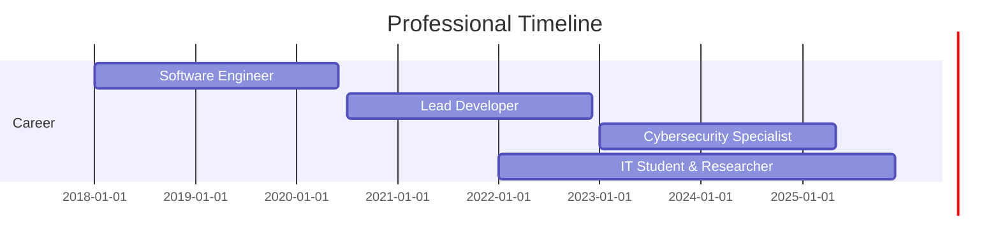

# Alejandro Areiza

**Full-Stack Developer | Cybersecurity Specialist | Computer Engineering Student**

---

## About Me

Aspiring technology leader and lifelong learner. I am a Computer Engineering student and multidisciplinary IT professional with a strong focus on software engineering, web development, cybersecurity, and data science. My passion is building secure, scalable, and intelligent solutions. I thrive at the intersection of back-end, front-end, security, and data—constantly seeking to bridge gaps and deliver value through technology.

---

## 🚩 Current Projects

- **Airline Management System:** Comprehensive Django-based platform with secure, modular architecture—distinct user/admin modules and robust data protection.
- **System Dynamics Modeling:** Simulation and analysis of ecosystem interactions (predator-prey, sustainability) using Stella.
- **Security Research:** Ongoing vulnerability assessment and penetration testing using Kali Linux, Metasploit, and Wireshark.
- **Database Automation:** Building robust, optimized, and scalable solutions for data migration, ETL, and analytics.

---

## 🛠️ Technology Stack

### Languages
 

### Frameworks & Libraries

### Databases

### DevOps & Tools

### Cybersecurity

### Data Science, Analysis & Modeling

---

## 📈 GitHub Interactive

  
<b>📊 Click to see my GitHub Stats & Streaks</b>

  

    
    
    
    
  

---

## 🧑‍💻 Professional Experience

---

## 🏆 Key Achievements

- Developed and deployed multiple production-level web applications with Django, improving operational efficiency by 40%.
- Implemented security protocols reducing vulnerability exposure by 65%.
- Built data pipelines and dynamic models predicting ecological patterns with 85% accuracy.
- Migrated legacy systems from MySQL to PostgreSQL, improving DB query response time by 30%.
- Published security research and contributed to open-source cybersecurity tools.
- Mentored junior developers and organized university-level coding workshops.

---

## 💡 Professional Philosophy

I approach technical challenges with a comprehensive perspective, integrating software engineering principles, security-first methodologies, and data-driven decision making. My multidisciplinary background as a Computer Engineering student and tech enthusiast enables me to create solutions that are robust, efficient, and secure.

---

## 🧩 Creative & Interactive

- **Code Sandbox:** [Try my code snippets and demos on CodeSandbox](https://codesandbox.io/u/alejandroareiza2346)
- **Cybersecurity Labs:** [Hack The Box Profile](https://www.hackthebox.com/) *(username: alejandroareiza2346)*
- **Dynamic Portfolio:** [My Portfolio (coming soon!)](#)
- **Database Playground:** [Public SQL Demos](https://www.db-fiddle.com/)

---

## 📚 Learning & Certifications

- Computer Engineering (BSc): Ongoing
- Offensive Security Certified Professional (OSCP): In progress
- AWS Certified Cloud Practitioner: In progress
- PostgreSQL for Developers (Coursera)
- Data Science Specialization (Coursera)

---

## 📫 Contact

I'm always interested in challenging projects, research, and collaboration. Feel free to connect:

- Email: [alejandroareiza2346@gmail.com](mailto:alejandroareiza2346@gmail.com)
- [LinkedIn](https://www.linkedin.com/in/alejandroareiza2346)
- [Twitter](https://twitter.com/yourtwitterhandle)
- [Portfolio](#) <!-- Add your portfolio URL here -->

---

  

---

This README is inspired by [awesome-github-profile-readme](https://github.com/abhisheknaiidu/awesome-github-profile-readme) and crafted to reflect my dynamic journey as an engineering student, developer, and cybersecurity enthusiast.

