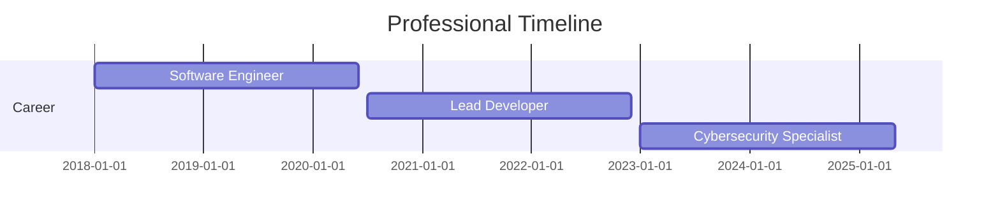

# Alejandro Areiza

**Full-Stack Developer & Cybersecurity Specialist**

---

## About Me

Multidisciplinary IT professional with expertise in software engineering, web development, and cybersecurity. I specialize in building secure and efficient digital solutions, combining technical skills with analytical thinking to solve complex problems.

---

## Current Projects

- **Airline Management System:** Developing a comprehensive platform with Django, featuring distinct user and admin modules, and leveraging secure data handling practices.
- **System Dynamics Modeling:** Analyzing ecosystem interactions and predator-prey relationships using Stella for predictive modeling.
- **Security Research:** Conducting ongoing security assessments and vulnerability research using Kali Linux.

---

## Technology Stack

### Languages
 

### Frameworks & Libraries

### Databases

### DevOps & Tools

### Cybersecurity

### Analysis & Modeling

---

## GitHub Statistics

  
  

---

## Professional Experience

---

## Key Achievements

- Developed and deployed multiple production-level web applications with Django, improving operational efficiency by 40%.
- Implemented comprehensive security protocols that reduced vulnerability exposure by 65%.
- Created system dynamics models that accurately predicted ecological patterns with 85% accuracy.
- Optimized database performance by migrating from MySQL to PostgreSQL, resulting in a 30% improvement in query response time.

---

## Professional Philosophy

I approach technical challenges with a comprehensive perspective, integrating software engineering principles with security-first methodologies. My multidisciplinary background enables me to create solutions that are not only functional and efficient but also secure and scalable.

---

## Contact

I'm always interested in challenging projects and collaborative opportunities. Feel free to reach out if you want to discuss potential collaborations or simply connect.

- Email: [alejandroareiza2346@gmail.com](mailto:alejandroareiza2346@gmail.com)
- [LinkedIn](https://www.linkedin.com/in/alejandroareiza2346)
- [Portfolio](#) <!-- Add your portfolio URL here -->

---

  

---

This README follows modern standards, inspired by the curated resources at [awesome-github-profile-readme](https://github.com/abhisheknaiidu/awesome-github-profile-readme).

